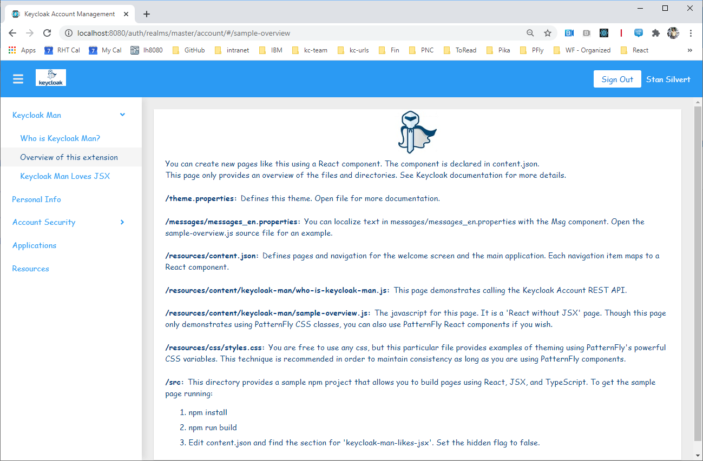
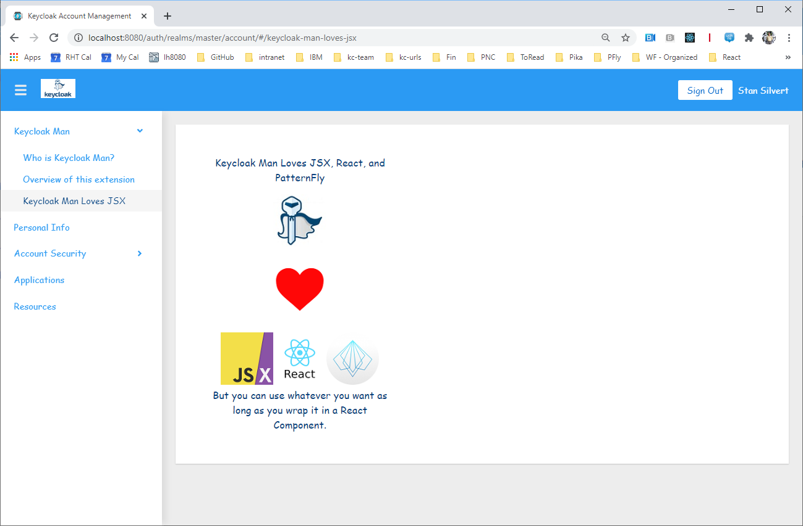

extend-account-console: Learn to extend the Account Console
===================================================

Level: Beginner
Technologies: PatternFly, React, JSX
Summary: "Keycloak Man" theme that extends Account Console
Target Product: Keycloak
Source: <https://github.com/keycloak/keycloak-quickstarts>

What is it?
-----------

The `extend-account-console` quickstart demonstrates how to create a new account theme that changes colors and fonts.
It also demonstrates two different ways you can add new pages to the account console application.

The theme is based on Keycloak Man, the retired mascot of the Keycloak project.

System Requirements
-------------------

There is nothing required to build this project.  However, if you want to do the JSX example, you will need to install npm on your system.

It is also recommended that you read about Keycloak themes in the Server Developer guide. 

Configuration in Keycloak
-----------------------

1. Do one of the following:
   * Deploy the theme as a JAR (recommended): run ``mvn clean install`` and copy ``target/keycloak-man-theme.jar``
     to ``<keycloak install>/standalone/deployments``.
   * Copy the [``keycloak-man``](src/main/resources/theme/keycloak-man) folder to your ``<keycloak install>/themes`` directory.
1. Open Keycloak Admin Console.
1. Go to the ``Realm Settings-->Themes`` tab.
1. Set Account Theme to ``keycloak-man``
1. Go to the account console.

Access the Quickstart
---------------------

You can access the account console with a URL like: <http://localhost:8080/auth/realms/master/account>.

Integration test of the Quickstart
----------------------------------

1. Make sure you have a Keycloak server running with an `admin` user and `admin` password in the `master` realm.
2. You need to have Chrome browser installed and updated to the latest version.
3. Run `mvn test -Pkeycloak-remote`.
