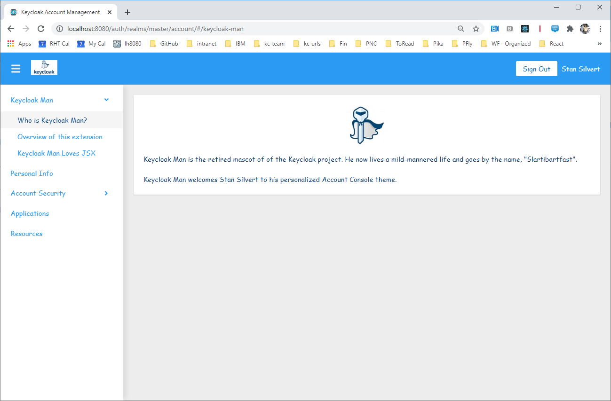

extend-account-console: Learn to extend the Account Console
===================================================

Level: Beginner
Technologies: PatternFly, React, JSX
Summary: "Keycloak Man" theme that extends Account Console
Target Product: <span>Keycloak</span>
Source: <https://github.com/keycloak/keycloak-quickstarts>


What is it?
-----------

The `extend-account-console` quickstart demonstrates how to create a new account theme that changes colors and fonts.
It also demonstrates two different ways you can add new pages to the account console application.

The theme is based on Keycloak Man, the retired mascot of the Keycloak project.




System Requirements
-------------------

You need to have <span>Keycloak</span> running. It is recommended to use Keycloak 22 or later.

All you need to build this project is Java 17 (Java SDK 17) or later and Maven 3.6.3 or later.

If you want to do the JSX example, you will need to install npm on your system.

It is also recommended that you read about Keycloak themes in the Server Developer guide. 


Configuration in <span>Keycloak</span>
-----------------------

To build the provider, run the following maven command:

   ````
   mvn -Pextension clean install -DskipTests=true
   ````

To install the provider, copy the `target/keycloak-man-theme.jar` JAR file to the `providers` directory of the server distribution.

Finally, start the server as follows:

    ```
    kc.[sh|bat] start-dev
    ```
1. Open Keycloak Admin Console.
2. Go to the ``Realm Settings-->Themes`` tab. 
3. Set Account Theme to ``keycloak-man``
4. Go to the account console.

Access the Quickstart
---------------------

You can access the account console with a URL like: <http://localhost:8080/realms/master/account>.

Integration test of the Quickstart
----------------------------------

1. Make sure you have an Keycloak server running with an admin user in the `master` realm or use the provided docker image. Your <span>Keycloak</span> should be listening on `http://localhost:8180`. You can archive this by running:

```
./kc.sh start-dev --http-port=8180
```

2. You need to have Chrome browser installed and updated to the latest version. See [README](../../README.md#chrome-driver-version) for additional details.
3. Run `mvn clean install -Dextension`
