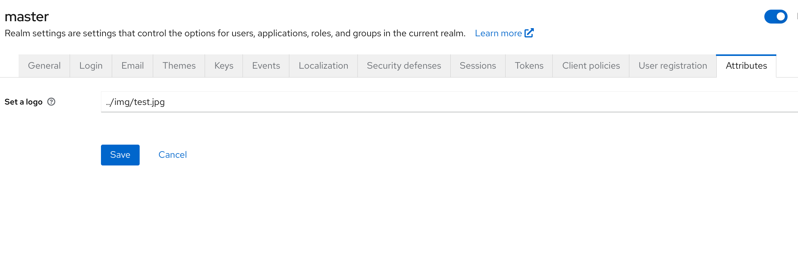
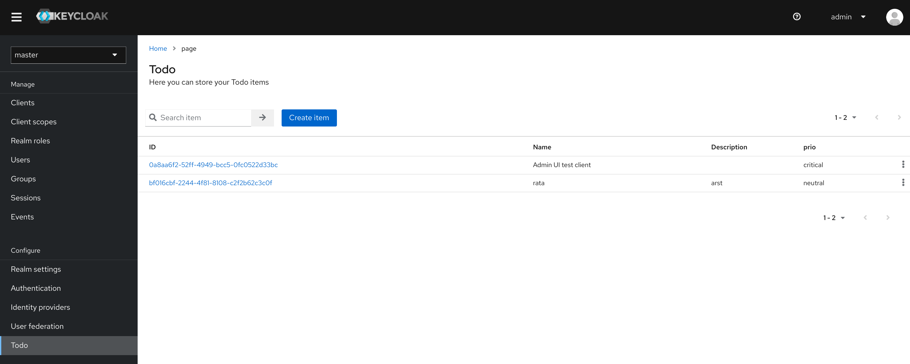
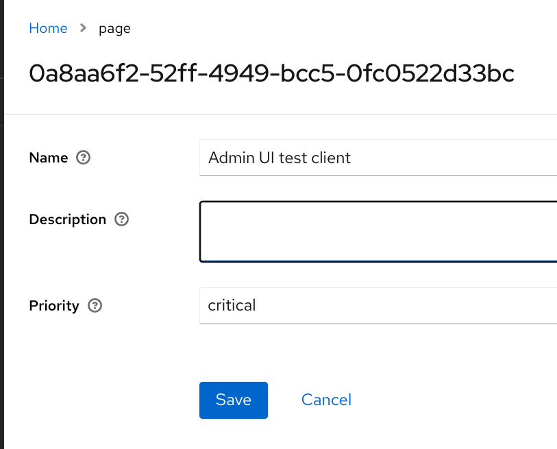

## Extending the admin ui with SPI

This example shows how you can extend the admin ui by implementing the SPI.
You can either add a tab to an existing page or have a complete section in the menu.
By implementing either:

  * `org.keycloak.services.ui.extend.UiPageProvider` for a complete section
  * `org.keycloak.services.ui.extend.UiTabProvider` for a tab

For both options you need to describe the fields you want on the page by using the `org.keycloak.provider.ProviderConfigProperty`
To specify where the tab will appear in the ui, you can add a path valid paths can be found in the `routes.ts` files in the admin-ui module of Keycloak project.

This example contains an implementation of both these. `AdminUiPage` is a todo section that is added.
And `ThemeUiTab` is an extra tab in the realm setting that let's you edit the realm attributes.

### Running

Run this example by compiling with maven:

```bash
mvn -Pextension clean install -DskipTests=true
```

Then copy the generated `extend-admin-ui.jar` into your <keycloak-server>/providers folder and run the server using `kc.[sh|bat] start-dev`.

### Screenshots

To illustrate how `getPath` method is used, check the `ThemeUiTab` class in this quickstart. The ThemeUi page can now be found when you navigate to _Realm settings_.


The `AdminUiPage` class illustrates how to introduce a new section into the main menu in admin console. It adds a Todo section as the last item in the side menu:


After you created an item you can view the details by clicking on it in the list:


### Integration test of the Quickstart
Make sure you have a Keycloak server running with an admin user in the master realm and copy the generated jar file into the providers folder.
Your Keycloak server should be listening on `http://localhost:8180`. You can achieve this by running:
```
./kc.sh start-dev --http-port=8180
```

You need to have Chrome browser installed and updated to the latest version. See the root README for additional details.
```
mvn clean install -Dextension
```

### Undeploy the quickstart
Remove the `extend-admin-ui.jar` from your providers folder and restart the server.