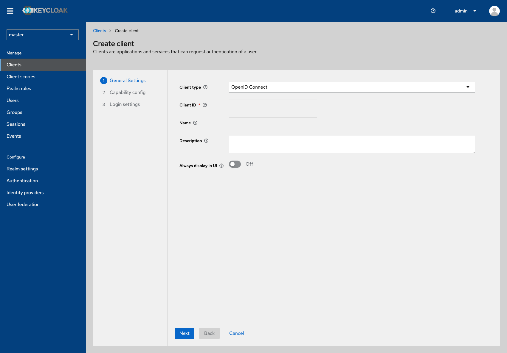

# Customizing Keycloak Themes

The Keycloak Admin Console, which is the interface for managing Keycloak, is built with [PatternFly](https://www.patternfly.org/v4/) - a set of UI design patterns and resources that can be used to create consistent, user-friendly interfaces for web applications.

## Creating Themes

With themes, it is possible to configure the Admin Console's look and feel. To ensure consistency and maintainability of the custom Keycloak theme, we advise using PatternFly best practices when customizing the Keycloak Admin Console. This includes following the recommended folder structure and using PatternFly CSS classes and guidelines when creating custom styles and overrides.

### Required Folder Structure

The recommended folder structure for a custom Keycloak theme is as follows:

    ├── my-cool-theme-name
    │   ├── admin
    │   │   ├── resources
    │   │   │   ├── css
    │   │   │   │   ├── styles.css
    │   │   └── theme.properties
    │   └── ...
    ├── ...

### Customizing with PatternFly Best Practices

Overrides to PatternFly variables should be made at the `:root` level for global variables or at the top-level component selector for component variables (for example, `.pf-c-\*`), as these overrides will cascade down to children elements accordingly. The examples are provided in the `styles.css` file.

### Applying a Customized Theme

Keycloak offers the `--spi-theme-folder-dir=/path/to/themes` flag which enables the specification of the directory where the custom theme is located, allowing for changes to be made directly to the source location without the need for copying files to the server. This can used by starting Keycloak server with the `--spi-theme-folder-dir=/path/to/themes` flag, and replacing `/path/to/themes` with the directory path of the custom theme.

As an alternative, it is possible to configure the `KC_THEME_FOLDER_DIR` environment variable with the path to the custom theme directory, which can be set at server startup or by defining the variable in the `keycloak.conf` file. See [Keycloak documentation](https://www.keycloak.org/server/configuration) for more details.

The Keycloak server can be started in development mode by using the command `kc start-dev --http-port=8180`, and to view the applied style, navigate to `http://localhost:8180/`.

This is what you will see when you log in, if you use the stylesheet provided.

When you access the Clients section, this is the view that will be presented to you.

**Built-in themes should not be modified directly. Instead a custom theme should be created.**
