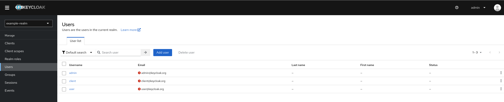

kubernetes: Keycloak Operator on Kubernetes
===================================================

Level: Beginner
Technologies: Keycloak Operator
Summary: Operate Keycloak with Keycloak Operator on Kubernetes
Target Product: Keycloak

What is it?
-----------

This quickstart demonstrates how to deploy the Keycloak Operator, and operate a Keycloak instance on Kubernetes environments.

It tries to focus on the main features provided by the Keycloak Operator, such as: deploy Keycloak instances,
and import a realm with some configuration.

System Requirements
-------------------

This quickstart requires to have [Minikube](https://minikube.sigs.k8s.io/docs/start/) installed, ideally with the Ingres addon enabled.

Starting Minikube
-------------------

To start minikube:

```shell
minikube start
```

To check if you have the Ingress addon enabled, enter the following command:

```shell
minikube addons list
```

If the Ingress addon is not enabled, enter the following command to enable it:

```shell
minikube addons enable ingress
```

Deploying Keycloak Operator
-------------------

You can install the Operator on Kubernetes by using `kubectl` commands:

```shell
kubectl apply -f https://raw.githubusercontent.com/keycloak/keycloak-k8s-resources/25.0.1/kubernetes/keycloaks.k8s.keycloak.org-v1.yml
kubectl apply -f https://raw.githubusercontent.com/keycloak/keycloak-k8s-resources/25.0.1/kubernetes/keycloakrealmimports.k8s.keycloak.org-v1.yml
kubectl apply -f https://raw.githubusercontent.com/keycloak/keycloak-k8s-resources/25.0.1/kubernetes/kubernetes.yml
```

Deploying PostgreSQL Database
-------------------

The Keycloak Operator does not deploy any database, so it is needed to have one before operate any Keycloak instance.

To deploy a sample PostgreSQL Database execute the command:

```shell
kubectl apply -f postgres-db-statefulset.yaml
```

The following command creates a secret with the database credentials. This secret will be used later by the Keycloak instance
to establish the connection to the database instance.

```shell
kubectl create secret generic keycloak-db-secret --from-literal=username=admin --from-literal=password=password
```

Deploying Keycloak
-------------------

The Keycloak instance is described using the `Keycloak` CRD. The [example-kc.yaml](./example-kc.yaml) file represents our
instance to be managed by the Keycloak Operator. This instance will disable the hostname and TLS certificates, just only
for this testing purposes, in production environments will require to verify them.

```shell
kubectl apply -f example-kc.yaml
```

Importing a new Realm
-------------------

Creating a new Realm, and its configuration, uses the `KeycloalRealmImport` CRD. The [my-realm-kc.yaml](my-realm-kc.yaml) file
describes a sample realm. Applying it on Kubernetes with the next command:

```shell
kubectl apply -f example-realm-kc.yaml
```

Accessing the Admin Console
-------------------

The Keycloak Operator will create a secret with the initial credentials of the `admin` user. These credentials are needed to
access to the Admin Console. To extract the values of these secret:

```shell
kubectl get secret example-kc-initial-admin -o jsonpath='{.data.password}' | base64 --decode
```

The following command will show the ingress created to access the Web console:

```shell
echo http://$(kubectl get ingress example-kc-ingress -o jsonpath='{.status.loadBalancer.ingress[0].ip}')
```

Using the right credentials from the `example-kc-initial-admin` secret, the Keycloak instance will show the `master`, and `example-realm` realms.
The `example-realm` will have some data already created, such as, the users.



References
--------------------

* [Keycloak Operator Installation](https://www.keycloak.org/operator/installation)
* [Basic Keycloak deployment](https://www.keycloak.org/operator/basic-deployment)
* [Keycloak Realm Import](https://www.keycloak.org/operator/realm-import)
