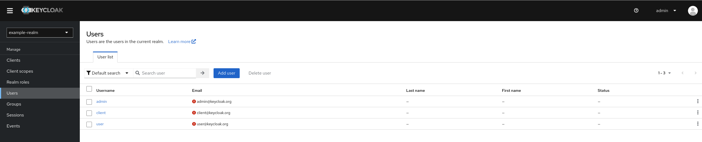

openshift: Keycloak Operator on OpenShift
===================================================

Level: Beginner
Technologies: Keycloak Operator
Summary: Operate Keycloak with Keycloak Operator on OpenShift
Target Product: Keycloak

What is it?
-----------

This quickstart demonstrates how to deploy the Keycloak Operator, and operate a Keycloak instance on OpenShift environments.

It tries to focus on the main features provided by the Keycloak Operator, such as: deploy Keycloak instances,
and import a realm with some configuration.

System Requirements
-------------------

This quickstart requires to have [CRC](https://crc.dev/crc/getting_started/getting_started/introducing/) installed.

Starting CRC
-------------------

To start minikube:

```shell
crc start
```

And create a sample project:

```shell
oc new-project keycloak-quickstart
```

Deploying Keycloak Operator
-------------------

CRC includes the Operator Lifecycle Manager (OLM), that it is the recommended way to install the Keycloak Operator.

Installing operators using OLM requires to have a user with `cluster-admin` role. This role can be granted in CRC with
the following command:

```shell
oc adm policy add-cluster-role-to-user cluster-admin developer
```

The Keycloak Operator can be installed using the OpenShift Web Console, or create a `Subscription` with the next command:

```shell
oc apply -f keycloak-operator-subscription.yaml
```

Deploying PostgreSQL Database
-------------------

The Keycloak Operator does not deploy any database, so it is needed to have one before operate any Keycloak instance.

To deploy a sample PostgreSQL Database execute the command:

```shell
kubectl apply -f postgres-db-statefulset.yaml
```

The following command creates a secret with the database credentials. This secret will be used later by the Keycloak instance
to establish the connection to the database instance.

```shell
kubectl create secret generic keycloak-db-secret --from-literal=username=admin --from-literal=password=password
```

Creating Hostname and TLS Certificate
-------------------

For a production ready installation, you need a hostname that can be used to contact Keycloak. See [Configuring the hostname](https://www.keycloak.org/server/hostname)
for the available configurations.

For development purposes, this guide will use `example-kc.apps-crc.testing`.

For development purposes, you can enter this command to obtain a self-signed certificate:

```shell
openssl req -subj '/CN=example-kc.apps-crc.testing/O=Test Keycloak./C=US' -newkey rsa:2048 -nodes -keyout key.pem -x509 -days 365 -out certificate.pem
```
You should install it in the cluster namespace as a Secret by entering this command:

```shell
oc create secret tls example-kc-tls-secret --cert certificate.pem --key key.pem
```

Deploying Keycloak
-------------------

The Keycloak instance is described using the `Keycloak` CRD. The [example-kc.yaml](./example-kc.yaml) file represents our
instance to be managed by the Keycloak Operator. This instance will disable the hostname and TLS certificates, just only
for this testing purposes, in production environments will require to verify them.

```shell
kubectl apply -f example-kc.yaml
```

Importing a new Realm
-------------------

Creating a new Realm, and its configuration, uses the `KeycloakRealmImport` CRD. The [my-realm-kc.yaml](my-realm-kc.yaml) file
describes a sample realm. Applying it on Kubernetes with the next command:

```shell
kubectl apply -f example-realm-kc.yaml
```

Accessing the Admin Console
-------------------

The Keycloak Operator will create a secret with the initial credentials of the `admin` user. These credentials are needed to
access to the Admin Console. To extract the values of these secret:

```shell
kubectl get secret example-kc-initial-admin -o jsonpath='{.data.password}' | base64 --decode
```

Open a browser and navigate to `example-kc.apps-crc.testing` and introduce the credentials to log in to Keycloak

Using the right credentials from the `example-kc-initial-admin` secret, the Keycloak instance will show the `master`, and `example-realm` realms.
The `example-realm` will have some data already created, such as, the users.



References
--------------------

* [Keycloak Operator Installation](https://www.keycloak.org/operator/installation)
* [Basic Keycloak deployment](https://www.keycloak.org/operator/basic-deployment)
* [Keycloak Realm Import](https://www.keycloak.org/operator/realm-import)
