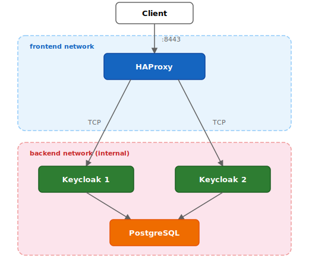

# Keycloak HA with HAProxy TLS Passthrough

This quickstart is for **educational purposes only** and should not be used in production.
It demonstrates how to configure HAProxy as a TLS passthrough load balancer in front of a clustered Keycloak deployment.

## What is TLS passthrough?

In TLS passthrough mode, the load balancer forwards encrypted TLS traffic directly to the backend servers without decrypting it.
HAProxy operates at the TCP layer (Layer 4) and has no visibility into the HTTP content.
The TLS connection is terminated by Keycloak itself, which means:

- Keycloak holds the TLS certificate and private key, not the proxy.
- HAProxy cannot inspect, modify, or cache HTTP headers or the request body.
- End-to-end encryption is preserved between the client and Keycloak.

## Architecture



- **HAProxy** listens on port 8443 and forwards raw TCP traffic to both Keycloak instances using round-robin.
  It uses the PROXY protocol v2 to pass the original client IP address to Keycloak.
  It is the only container attached to the `frontend` network, making it the single entry point.
- **Keycloak 1 & 2** are clustered via embedded Infinispan.
  They terminate TLS and share the same PostgreSQL database.
  They live exclusively on the `backend` network, which is marked as `internal` and unreachable from the host.
- **PostgreSQL** provides the shared database for Keycloak on the `backend` network.

## Prerequisites

- Docker and Docker Compose
- `openssl` (for certificate generation)

## Quick start

### 1. Generate a TLS certificate

```bash
./generate-certs.sh <hostname>
```

This example uses [nip.io](https://nip.io), a DNS service that maps `127.0.0.1.nip.io` to `127.0.0.1`, avoiding the need
to edit `/etc/hosts`:

```bash
./generate-certs.sh 127.0.0.1.nip.io
```

### 2. Start the services

```bash
KC_HOST=<hostname> docker compose up -d
```

For example:

```bash
KC_HOST=127.0.0.1.nip.io docker compose up -d
```

### 3. Access Keycloak

Once the services are up, Keycloak is available at `https://<hostname>:8443`.
Log in to the admin console using credentials `admin` / `admin`.

The browser will show a certificate warning because the certificate is self-signed.
This is expected and can be safely accepted for local testing.

### 4. Check HAProxy stats

Open [http://localhost:8404/stats](http://localhost:8404/stats) in a browser to verify that both Keycloak backends are healthy.

### 5. Showcase graceful shutdown

This is a walkthrough through a graceful shutdown of one of the Keycloak instances: 

1. Open [http://localhost:8404/stats](http://localhost:8404/stats) in a browser to verify that both Keycloak backends are healthy.
2. Send a `TERM` signal to one of the Keycloak containers for a graceful shutdown (takes 30 seconds). Container exits with code 143.
   ```bash
   docker stop passthrough-keycloak1-1 -t 60
   ```
3. Observe that after 3x5=15 seconds the `keycloak1` backend turns UP/green to UP/yelllow and eventually to DOWN/red.
   Requests are still served by the node until it shuts down gracefully after 30 seconds.  
4. Start the Keycloak container again:  
   ```bash
   docker start passthrough-keycloak1-1
   ```
5. Observe that after 2x5=10 seconds the `keycloak1` backend turns DOWN/yellow and eventually UP/green.

### 6. Stop the services

```bash
docker compose down
```

## HAProxy configuration

The key parts of `haproxy.cfg` are explained below.

**TCP mode for TLS passthrough:**

```
mode tcp
```

HAProxy operates in TCP mode (Layer 4), forwarding raw bytes without decrypting TLS. It never sees the plaintext HTTP traffic.

**HTTP health check on the management port:**

```
option httpchk GET /health/ready
http-check expect status 200
```

HAProxy performs health checks against Keycloak's management endpoint `/health/ready`, expecting an HTTP 200 response.
This endpoint is only available when Keycloak is configured with `KC_HEALTH_ENABLED=true` and `KC_METRICS_ENABLED=true`.

**Server lines:**

```
server keycloak1 keycloak1:8443 send-proxy-v2 check port 9000 check-ssl verify none inter 5s fall 3 rise 2
```

- `send-proxy-v2` enables the PROXY protocol v2, which prepends the original client IP address to the TCP connection so Keycloak sees the real source IP instead of HAProxy's.
Version 1 (`send-proxy`) is also supported.
This requires Keycloak to be configured with `KC_PROXY_PROTOCOL_ENABLED=true`.

- `check port 9000 check-ssl verify none` directs health checks to the management port (9000) over HTTPS, skipping certificate verification for the health check connection.

- `inter 5s fall 3 rise 2` configures the health check frequency: poll every 5 seconds, mark a server as down after 3 consecutive failures, and mark it as up again after 2 consecutive successes.

**Graceful shutdown timing:**

With the values above, it may take up to 15 seconds (3 failures x 5s interval) for HAProxy to detect that a Keycloak instance is down.
For this reason, Keycloak is configured with `KC_SHUTDOWN_DELAY=30s` and
`KC_SHUTDOWN_TIMEOUT=30s`, giving HAProxy enough time to detect the shutdown and allowing existing client connections to drain gracefully.

## Resources

- [HAProxy Configuration Manual](https://www.haproxy.com/documentation/haproxy-configuration-manual/latest/)
- [Keycloak Reverse Proxy Configuration](https://www.keycloak.org/server/reverseproxy)
