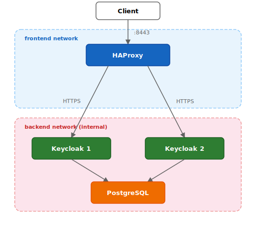

# Keycloak HA with HAProxy TLS Re-encrypt

This quickstart is for **educational purposes only** and should not be used in production.
It demonstrates how to configure HAProxy as a TLS re-encrypt load balancer in front of a clustered Keycloak deployment.

## What is TLS re-encrypt?

In TLS re-encrypt mode, the load balancer decrypts the incoming HTTPS connection and establishes a new HTTPS connection to the backend service.
HAProxy operates at the HTTP layer (Layer 7) and has a direct access to the HTTP content.

- HAProxy can inspect, modify, and cache HTTP headers and the request body. The end-to-end encryption between the client and Keycloak is _not preserved._
- HAProxy holds a TLS certificate and a private key used to authenticate itself to the client.
- HAProxy holds a TLS certificate and a private key used to authenticate itself to Keycloak.
- Keycloak holds a TLS certificate and a private key used to authenticate itself to HAProxy.

## Architecture



- **HAProxy** listens on port 8443, terminates the incoming HTTPS connections and reencrypts the requests before forwarding them to Keycloak instances.
  It uses the `Forwarded` HTTP header to pass the original client IP address to Keycloak.
  It is the only container attached to the `frontend` network, making it the single entry point.
- **Keycloak 1 & 2** are clustered via embedded Infinispan and share the same PostgreSQL database.
  They live exclusively on the `backend` network, which is marked as `internal` and unreachable from the host.
- **PostgreSQL** provides the shared database for Keycloak on the `backend` network.

## Prerequisites

- Docker and Docker Compose
- `openssl` (for certificate generation)

## Quick start

### 1. Generate a TLS certificate

```bash
./generate-certs.sh <hostname>
```

This example uses [nip.io](https://nip.io), a DNS service that maps `127.0.0.1.nip.io` to `127.0.0.1`, avoiding the need to edit `/etc/hosts`:

```bash
./generate-certs.sh 127.0.0.1.nip.io
```

### 2. Start the services

```bash
KC_HOST=<hostname> docker compose up -d
```

For example:

```bash
KC_HOST=127.0.0.1.nip.io docker compose up -d
```

### 3. Access Keycloak

Once the services are up, Keycloak is available at `https://<hostname>:8443`.
Log in to the admin console using credentials `admin` / `admin`.

The browser will show a certificate warning because the certificate is self-signed.
This is expected and can be safely accepted for local testing.

### 4. Check HAProxy stats

Open [http://127.0.0.1.nip.io:8404/stats](http://127.0.0.1.nip.io:8404/stats) in a browser to verify that both Keycloak backends are healthy.

### 5. Showcase graceful shutdown

This is a walkthrough through a graceful shutdown of one of the Keycloak instances: 

1. Open [http://127.0.0.1.nip.io:8404/stats](http://127.0.0.1.nip.io:8404/stats) in a browser to verify that both Keycloak backends are healthy.
2. Send a `TERM` signal to one of the Keycloak containers for a graceful shutdown (takes 30 seconds). Container exits with code 143.
   ```bash
   docker compose stop keycloak1 -t 60
   ```
3. Observe that after 3x5=15 seconds the `keycloak1` backend turns UP/green to UP/yellow and eventually to DOWN/red.
   Requests are still served by the node until it shuts down gracefully after 30 seconds.  
4. Start the Keycloak container again:  
   ```bash
   docker compose start keycloak1
   ```
5. Observe that after 2x5=10 seconds the `keycloak1` backend turns DOWN/yellow and eventually UP/green.

### 6. Stop the services

```bash
docker compose down
```

## HAProxy configuration

The key parts of `haproxy.cfg` are explained below.


**Certificate for external access:**

```
bind *:8443 ssl crt /mnt/certs/haproxy-external.pem
```

HAProxy will use this certificate to authenticate itself to the client.

**HTTP mode for TLS re-encrypt:**

```
mode http
```

HAProxy operates in HTTP mode (Layer 7), decrypting and reencrypting HTTP traffic before forwarding to Keycloak.

**Replace the `Forwarded` and `X-Forwarded-` headers:**

```
http-request del-header Forwarded
http-request del-header x-forwarded-for
http-request del-header x-forwarded-proto
http-request del-header x-forwarded-host
http-request del-header x-forwarded-port
http-request del-header x-forwarded-server
```

This configuration will drop `Forwarded` and `X-Forwarded-` HTTP headers on the proxy, preventing the client from providing misleading information to the backend server.

Note: If the `KC_PROXY_HEADERS` setting is set to `forwarded` (see below) Keycloak will only accept the standard `Forwarded` header and ignore any `X-Forwarded-` headers. In this case it is not strictly necessary to filter them on the proxy.

```
option forwarded host by by_port for
```

The above configuration will make HAProxy add a standard `Forwarded` HTTP header with the actual information from the incoming connection.

**HTTP health check on the management port:**

```
option httpchk GET /health/ready
http-check expect status 200
```

HAProxy performs health checks against Keycloak's management endpoint `/health/ready`, expecting an HTTP 200 response.
This endpoint is only available when Keycloak is configured with `KC_HEALTH_ENABLED=true` and `KC_METRICS_ENABLED=true`.

**Server lines:**

```
server keycloak1 keycloak1:8443 ssl verify required crt /mnt/certs/haproxy-internal.pem ca-file /mnt/certs/keycloak1-cert.pem check port 9000 check-ssl verify none inter 5s fall 3 rise 2
```

- `ssl verify required` enables a secured connection to Keycloak.

- `crt /mnt/certs/haproxy-internal.pem` configures the certificate used to authenticate HAProxy to Keycloak.

- `ca-file /mnt/certs/keycloak1-cert.pem` configures the certificate used to authenticate Keycloak to HAProxy.

- `check port 9000 check-ssl verify none` directs health checks to the management port (9000) over HTTPS, skipping certificate verification for the health check connection.

- `inter 5s fall 3 rise 2` configures the health check frequency: poll every 5 seconds, mark a server as down after 3 consecutive failures, and mark it as up again after 2 consecutive successes.

**Graceful shutdown timing:**

With the values above, it may take up to 15 seconds (3 failures x 5s interval) for HAProxy to detect that a Keycloak instance is down.
For this reason, Keycloak is configured with `KC_SHUTDOWN_DELAY=30s` and
`KC_SHUTDOWN_TIMEOUT=30s`, giving HAProxy enough time to detect the shutdown and allowing existing client connections to drain gracefully.

## Keycloak configuration

**Configure accepted proxy headers:**

```
KC_PROXY_HEADERS: forwarded
```

Keycloak will only accept the standard `Forwarded` HTTP header, ignoring any `X-Forwarded-` headers.

**Configure the certificate and private key for HTTPS:**

```
KC_HTTPS_CERTIFICATE_FILE: /opt/keycloak/certs/cert.pem
KC_HTTPS_CERTIFICATE_KEY_FILE: /opt/keycloak/certs/key.pem      
```

The certificate is used by HAProxy to authenticate the Keycloak server.

**Configure mTLS:**

```
KC_HTTPS_CLIENT_AUTH: required
KC_HTTPS_TRUST_STORE_FILE: /opt/keycloak/conf/https-truststore/haproxy-internal-cert.pem
```

Keycloak will require client authentication via certificates provided in the truststore. In this case the only provided certificate is for authenticating HAProxy on the internal network.

```
KC_HTTPS_MANAGEMENT_CLIENT_AUTH: none
```

This setting disables the client authentication requirement for the management endpoint.

## Resources

- [HAProxy Configuration Manual](https://www.haproxy.com/documentation/haproxy-configuration-manual/latest/)
- [Keycloak Reverse Proxy Configuration](https://www.keycloak.org/server/reverseproxy)
- [Configuring trusted certificates for mTLS](https://www.keycloak.org/server/mutual-tls)
