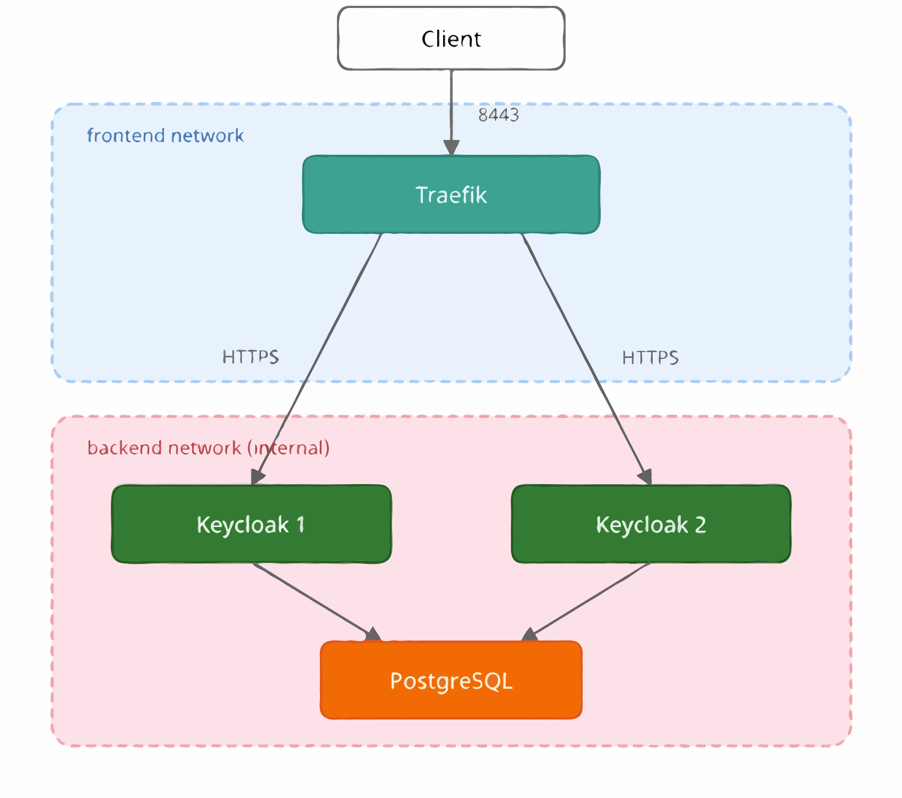

# Keycloak HA with Traefik TLS Re-encrypt

This quickstart is for **educational purposes only** and should not be used in production.
It demonstrates how to configure Traefik as a TLS re-encrypt load balancer in front of a clustered Keycloak deployment.

## What is TLS re-encrypt?

In TLS re-encrypt mode, the load balancer decrypts the incoming HTTPS connection and establishes a new HTTPS connection to the backend service.
Traefik operates at the HTTP layer (Layer 7) and has direct access to the HTTP content.

- Traefik can inspect, modify, and cache HTTP headers and the request body. The end-to-end encryption between the client and Keycloak is _not preserved._
- Traefik holds a TLS certificate and a private key used to authenticate itself to the client.
- Traefik holds a TLS certificate and a private key used to authenticate itself to Keycloak.
- Keycloak holds a TLS certificate and a private key used to authenticate itself to Traefik.

## Architecture



- **Traefik** listens on port 8443, terminates the incoming HTTPS connections and reencrypts the requests before forwarding them to Keycloak instances.
  It uses the `X-Forwarded-*` HTTP headers to pass the original client IP address to Keycloak.
  It is the only container attached to the `frontend` network, making it the single entry point.
- **Keycloak 1 & 2** are clustered via embedded Infinispan and share the same PostgreSQL database.
  They live exclusively on the `backend` network, which is marked as `internal` and unreachable from the host.
- **PostgreSQL** provides the shared database for Keycloak on the `backend` network.

## Prerequisites

- Docker and Docker Compose
- `openssl` (for certificate generation)

## Quick start

### 1. Generate a TLS certificate

```bash
./generate-certs.sh <hostname>
```

This example uses [nip.io](https://nip.io), a DNS service that maps `127.0.0.1.nip.io` to `127.0.0.1`, avoiding the need to edit `/etc/hosts`:

```bash
./generate-certs.sh 127.0.0.1.nip.io
```

### 2. Start the services

```bash
KC_HOST=<hostname> docker compose up -d
```

For example:

```bash
KC_HOST=127.0.0.1.nip.io docker compose up -d
```

### 3. Access Keycloak

Once the services are up, Keycloak is available at `https://<hostname>:8443`.
Log in to the admin console using credentials `admin` / `admin`.

The browser will show a certificate warning because the certificate is self-signed.
This is expected and can be safely accepted for local testing.

### 4. Check Traefik dashboard

Open [http://127.0.0.1.nip.io:8080/dashboard/](http://127.0.0.1.nip.io:8080/dashboard/) in a browser to verify that both Keycloak backends are healthy.

### 5. Showcase graceful shutdown

This is a walkthrough through a graceful shutdown of one of the Keycloak instances:

1. Open [http://127.0.0.1.nip.io:8080/dashboard/](http://127.0.0.1.nip.io:8080/dashboard/) in a browser to verify that both Keycloak backends are healthy.
2. Send a `TERM` signal to one of the Keycloak containers for a graceful shutdown (takes 30 seconds). Container exits with code 143.
```bash
   docker compose stop keycloak1 -t 60
```

3. Observe that after 5 seconds the `keycloak1` backend is marked as unhealthy in the Traefik dashboard.
   New requests are routed to `keycloak2`, while `keycloak1` continues serving existing connections during its 30-second graceful shutdown.

4. Start the Keycloak container again:
```bash
   docker compose start keycloak1
```
5. Observe that after 5 seconds the `keycloak1` backend is marked as healthy again in the Traefik dashboard.

### 6. Stop the services

```bash
docker compose down
```

## Traefik configuration

The key parts of `keycloak.yaml` are explained below. The `keycloak.yaml` file contains the
dynamic configuration — routing rules, TLS certificates, and backend transport settings.

**Certificate for external access:**

```yaml
tls:
  certificates:
    - certFile: /certs/traefik-external/cert.pem
      keyFile: /certs/traefik-external/key.pem
```

Traefik will use this certificate to authenticate itself to the browser.
This is the certificate the client sees when connecting to Traefik on port 8443.
It is separate from the internal certificate used for mTLS between Traefik and Keycloak.

**Filter header from external clients:**

A headers middleware drops headers that a client could use to mislead or overwhelm the backend.
In Traefik, a `customRequestHeaders` entry with an empty string ("") value removes that header from the request before it is forwarded to Keycloak:

```yaml
  middlewares:
    filter-headers:
      headers:
        customRequestHeaders:
          Forwarded: ""
          X-Forwarded-For: ""
          X-Forwarded-Proto: ""
          X-Forwarded-Host: ""
          X-Forwarded-Port: ""
          X-Forwarded-Server: ""
          X-Forwarded-Prefix: ""
          X-Forwarded-Access-Token: ""
          X-Original-Forwarded-For: ""
          X-Original-URL: ""
          X-Original-Method: ""
          X-Real-IP: ""
          Traceparent: ""
          Tracestate: ""
          Baggage: ""
          B3: ""
          X-B3-Traceid: ""
          X-B3-Spanid: ""
          X-B3-Parentspanid: ""
          X-B3-Sampled: ""
          X-B3-Flags: ""
          Uber-Trace-Id: ""
          X-Ot-Span-Context: ""
```

This configuration drops several categories of headers that an external client could use to mislead the backend server:

Note: If the `KC_PROXY_HEADERS` setting is set to forwarded (see below), Keycloak will only accept the standard Forwarded header and ignore any `X-Forwarded-` headers. In this case, it is not strictly necessary to filter them on the proxy. Filtering them at the proxy is still a good practice for defense in depth.

- `Forwarded` and `X-Forwarded-*` carry information about the original client connection (IP address, protocol, host). If not stripped, a client can forge them to spoof its identity. Since Traefik handles explicit key/value matching rather than wildcard regex blocks, defining each variant with an empty string ensures comprehensive removal of `X-Forwarded-For`, `X-Forwarded-Proto`, `X-Forwarded-Host`, `X-Forwarded-Port`, `X-Forwarded-Server`, `X-Forwarded-Prefix`, and `X-Forwarded-Access-Token` (injected by some OAuth2 proxies to pass a token to the backend).

`X-Forwarded-Prefix` is particularly important to filter because an attacker can use it to manipulate URL generation and redirect targets, potentially enabling path-based attacks such as open redirects or cache poisoning.

`X-Original-*` includes headers like `X-Original-Forwarded-For` (a variant of `X-Forwarded-For` set by some proxies), `X-Original-URL`, and `X-Original-Method` (used by authentication proxies such as Traefik ForwardAuth and NGINX auth_request). If a backend extension inspects these headers, an attacker could forge the originating IP, request path, or method seen by the authorization layer.

`X-Real-IP` is commonly trusted by applications for rate limiting and audit logging, making it a spoofing target.

Once stripped, Traefik will append its own verified connection metadata back to the backend request using its default proxy behavior.

**HTTP health check on the management port:**

```yaml
healthCheck:
  path: /health/ready
  port: 9000
  scheme: https
  interval: "5s"
  timeout: "3s"
```

Traefik performs health checks against Keycloak's management endpoint `/health/ready` on port 9000, expecting an HTTP 200 response.
This endpoint is available when Keycloak is configured with `KC_HEALTH_ENABLED=true`.

**mTLS to Keycloak (serversTransport):**

```yaml
serversTransports:
  keycloak-transport:
    certificates:
      - certFile: /certs/traefik-internal/cert.pem
        keyFile: /certs/traefik-internal/key.pem
    rootCAs:
      - /certs/keycloak1-cert.pem
      - /certs/keycloak2-cert.pem
```

- `certificates` configures the certificate Traefik presents to Keycloak during the mTLS handshake.
- `rootCAs` configures the certificates used to verify Keycloak's identity.

**Graceful shutdown timing:**

Health checks poll every 5 seconds with a 3 seconds timeout. It takes up to 8 seconds (`interval + timeout`) for Traefik to detect that a keycloak instance is down.
For this reason, Keycloak is configured with `KC_SHUTDOWN_DELAY=8s` to give Traefik enough time to detect the shutdown and stop routing traffic to the instance.

## Keycloak configuration

**Configure accepted proxy headers:**

```
KC_PROXY_HEADERS: xforwarded
```
Keycloak will accept the `X-Forwarded-*` HTTP headers that Traefik adds automatically.

**Configure the certificate and private key for HTTPS:**

```
KC_HTTPS_CERTIFICATE_FILE: /opt/keycloak/certs/cert.pem
KC_HTTPS_CERTIFICATE_KEY_FILE: /opt/keycloak/certs/key.pem  
```
Keycloak uses this certificate to identify itself to Traefik during the TLS handshake.

**Configure mTLS:**

```
KC_HTTPS_CLIENT_AUTH: required
KC_HTTPS_TRUST_STORE_FILE: /opt/keycloak/conf/https-truststore/traefik-internal-cert.pem
```

Mutual TLS (mTLS) requires Keycloak to authenticate the connecting client.
`KC_HTTPS_CLIENT_AUTH: required` enforces that any client connecting to Keycloak on port 8443 must present a valid certificate.
`KC_HTTPS_TRUST_STORE_FILE` specifies the truststore containing the only accepted certificate, ensuring that only Traefik can connect to Keycloak on the backend network.

```
KC_HTTPS_MANAGEMENT_CLIENT_AUTH: none
```
This setting disables client certificate authentication on the management endpoint (port 9000).
While the main HTTPS port (8443) requires Traefik to present its `traefik-internal` certificate,
the management port is used exclusively for health checks and does not need mutual authentication.

## Resources

- [Traefik Documentation](https://doc.traefik.io/traefik/)
- [Traefik ServersTransport](https://doc.traefik.io/traefik/routing/services/#serverstransport)
- [Traefik TLS Configuration](https://doc.traefik.io/traefik/https/tls/)
- [Keycloak Reverse Proxy Configuration](https://www.keycloak.org/server/reverseproxy)
- [Configuring trusted certificates for mTLS](https://www.keycloak.org/server/mutual-tls)